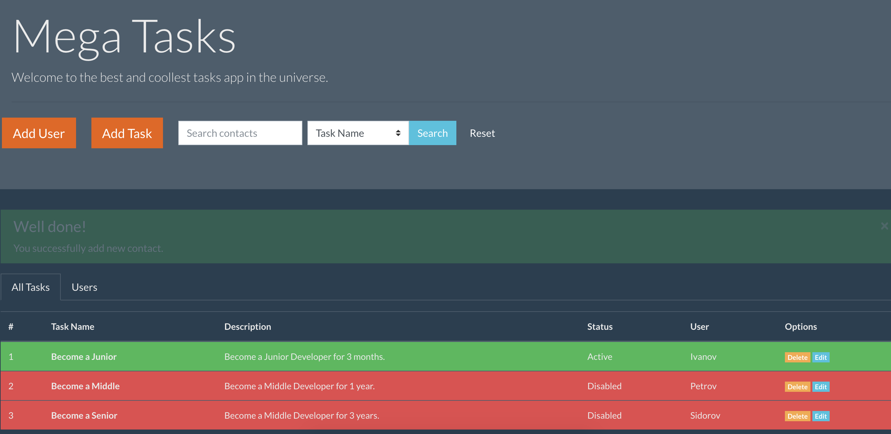
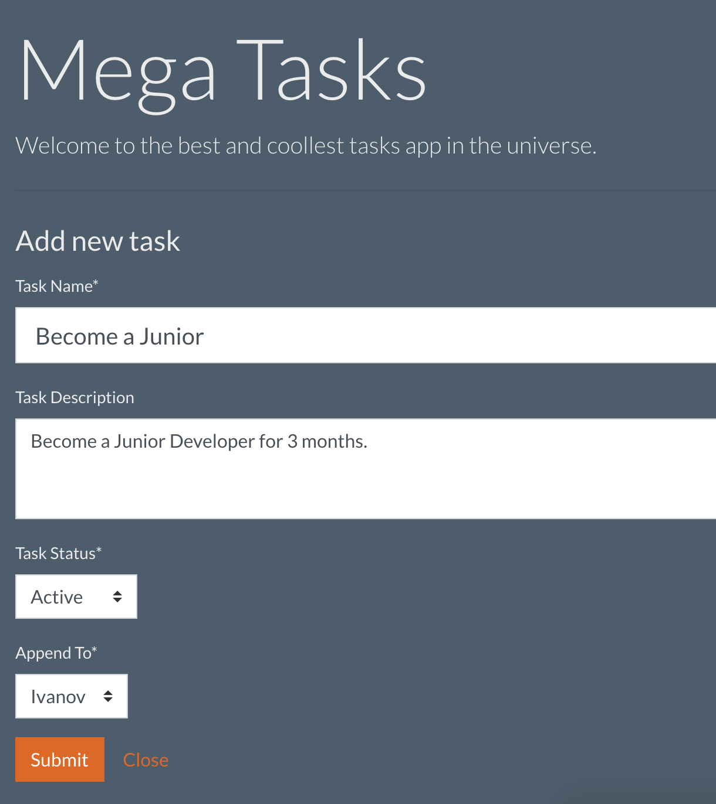
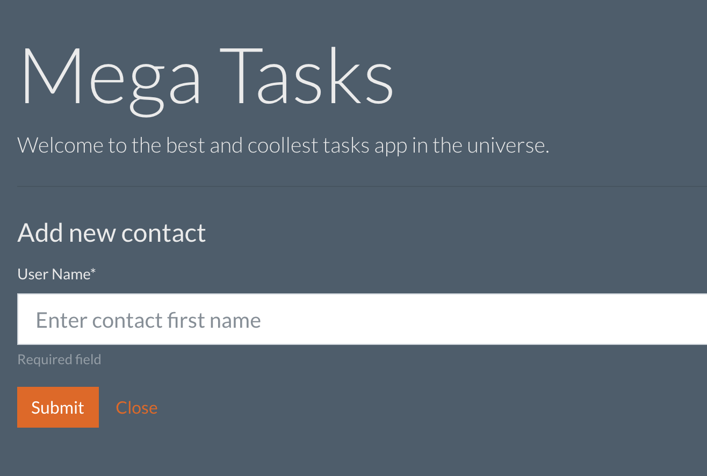
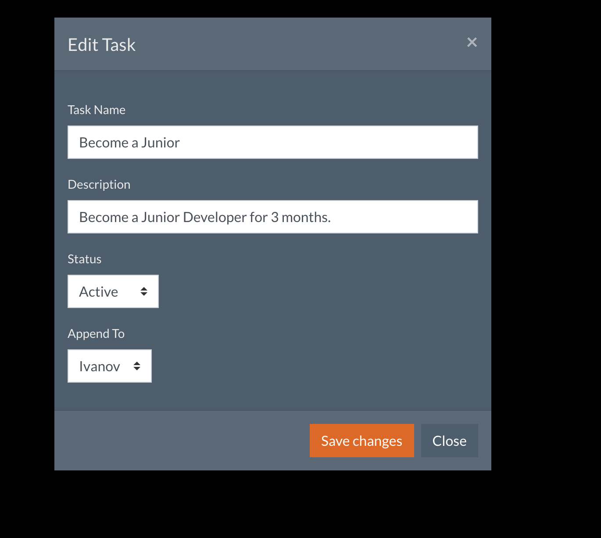
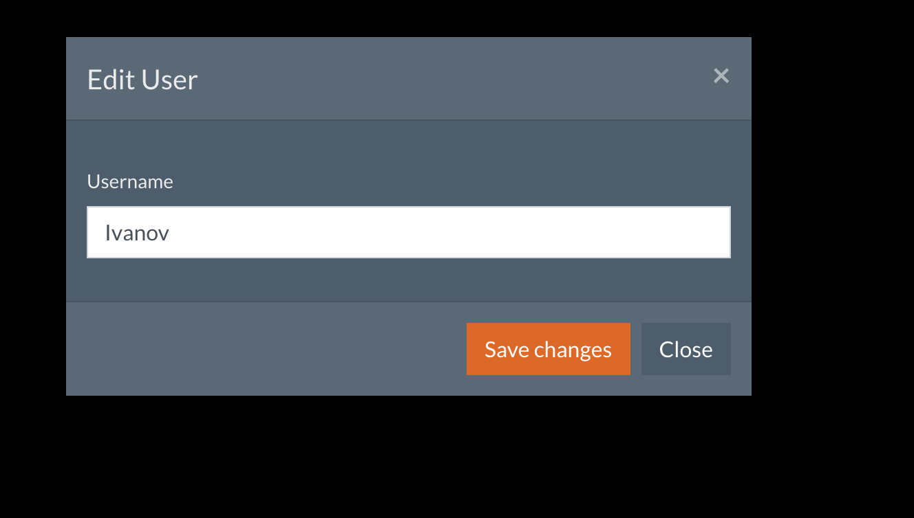
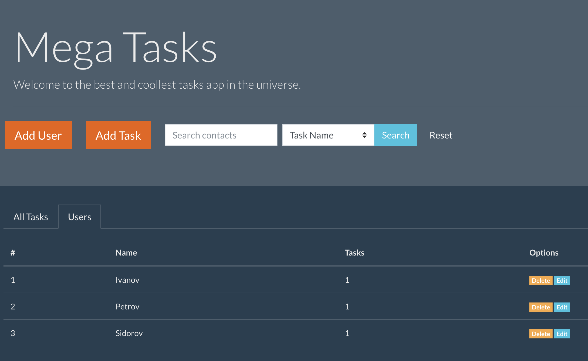
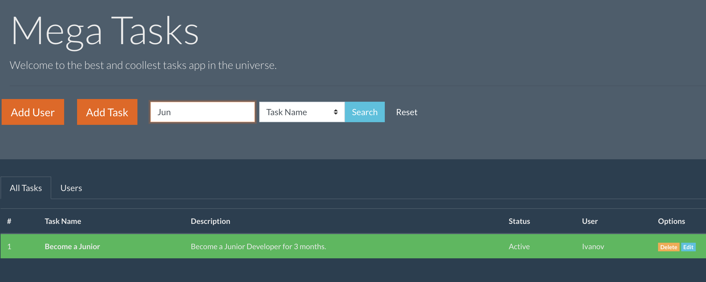

# Task Manager Web App
---
Home work for the Netology.ru lesson "Mongoose library".

Using:
+ Add new MongoDB database `taskman` with `users` and `tasks` collections.
+ Run `mongod`
+ Run webserver `node app/index.js`

Used tools:
+ NodeJS
+ Express
+ MongoDB
+ Mongoose
+ JQuery
+ Bootstrap

__Features__:
1. One page app without reloading.
2. List all tasks with linked user on main page.
2. List all users with tasks amount on main page.
3. Add/edit/delete users.
3. Add/edit/delete tasks.
4. Attach task to any user.
6. Search in tasks list.

__To Do__
1. Pagination
2. Additional info
3. Contact info modal window
4. Forms validation

***

